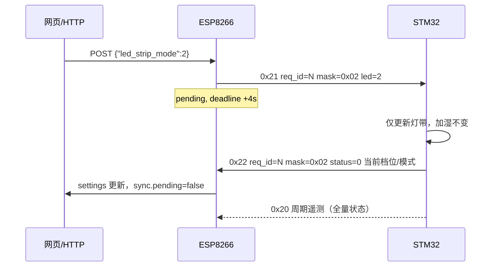

# ESP8266 ↔ STM32 串口链路协议（业务层）

本文描述 **在 `TySerialFrame` 帧封装之上** 的业务命令、载荷与 **请求–应答** 约定。物理层为 UART（本工程默认与 USB `Serial` 复用，仅在 STA 已连接、文本配网 CLI 关闭后由 ESP 独占）。

帧格式（SOF、LEN、CRC8）以 **`include/TySerialFrame/TySerialFrame.h`** 为准，此处只定义 **CMD** 与 **PAYLOAD** 字节布局。

---

## 1. 协议分层与标识符

```
┌─────────────────────────────────────────────────────────┐
│  TySerialFrame：SOF / CMD / LEN / CRC8（传输层）          │
├─────────────────────────────────────────────────────────┤
│  业务 CMD：0x20 遥测 | 0x21 写设置 | 0x22 写应答          │
├─────────────────────────────────────────────────────────┤
│  0x21/0x22 事务：req_id 配对 + change_mask 字段选择       │
└─────────────────────────────────────────────────────────┘
```

| 名称 | 所在位置 | 作用 |
|------|----------|------|
| **CMD** | 帧头 `CMD` 字节 | 区分报文类型（`0x20` / `0x21` / `0x22`），见 §2 |
| **req_id** | 0x21、0x22 载荷字节 0 | **请求事务 ID**（1–255）。ESP 每发一帧 0x21 递增；STM32 必须在 0x22 中原样回填，用于配对「这一笔」写操作 |
| **change_mask** | 0x21 字节 1；0x22 字节 2（回显） | **变更掩码**：标明本次 0x21 **要改哪些字段**；未置位的字段 MCU **不得修改** |
| **载荷数值** | 0x21 字节 2–3 | 仅当对应 `change_mask` 位为 1 时，该字节为有效新值 |

**单控 vs 合包（同一 CMD `0x21`）**

| 场景 | `change_mask` | 说明 |
|------|---------------|------|
| 只改加湿档位 | `0x01` | 仅应用字节 2；字节 3 忽略 |
| 只改灯带模式 | `0x02` | 仅应用字节 3；字节 2 忽略 |
| 同时改两项 | `0x03` | 合包；字节 2、3 均生效 |

`change_mask == 0x00` 为 **非法**，STM32 应 `status != 0` 拒绝，且不改变任何参数。

---

## 2. 命令一览

| CMD  | 方向        | 名称           | 说明 |
|------|-------------|----------------|------|
| 0x20 | STM32 → ESP | `SensorReport` | 周期性全量遥测；**缓存**为网页「传感器」数据源 |
| 0x21 | ESP → STM32 | `SetRequest`   | 按 `change_mask` **单控或合包**写设置；**必须**用 0x22、`req_id` 一致应答 |
| 0x22 | STM32 → ESP | `SetAck`       | 对匹配的 0x21 确认或拒绝；回显 `change_mask` 并带回 **当前生效** 的完整设定 |

STM32 本地改参数（按键等）时，仍应通过 **0x20** 上报当前「设备侧已生效」的状态，以便网页与下发结果一致。

---

## 3. 枚举与语义

### 3.1 加湿 / 运行档位 `humidifier_level`

| 值 | 含义 |
|----|------|
| 0  | 关闭 |
| 1  | 1 档（最低运行） |
| 2  | 2 档 |
| 3  | 3 档（最高） |

遥测 0x20 字节 3 作为网页 **档位显示**；超出 0–3 建议 MCU 不发，ESP 可丢弃整帧。

### 3.2 灯带工作模式 `led_strip_mode`

| 值 | 含义 |
|----|------|
| 0  | 常亮 |
| 1  | 呼吸 |
| 2  | 流水 |
| 3  | 音律（随麦克风/音量强度变化） |

### 3.3 变更掩码 `change_mask`（0x21 / 0x22）

| 位 | 值 | 名称 | 为 1 时 |
|----|-----|------|---------|
| 0 | `0x01` | `CHG_HUMID` | 应用 `humidifier_level`（0x21 字节 2） |
| 1 | `0x02` | `CHG_LED` | 应用 `led_strip_mode`（0x21 字节 3） |
| 2–7 | — | 保留 | 必须为 0；非 0 时建议 `status = 4` 拒绝 |

### 3.4 状态标志 `status_flags`（0x20 字节 5，按位）

| 位 | 名称 | 1 = | 0 = |
|----|------|-----|-----|
| 0  | `overheat` | 过热异常 | 常温 |
| 1–7 | — | 保留，须填 0 | |

### 3.5 `SetAck.status` 建议错误码（可扩展）

| 值 | 含义 |
|----|------|
| 0 | 成功 |
| 1 | `change_mask` 为 0 |
| 2 | `humidifier_level` 非法（非 0–3） |
| 3 | `led_strip_mode` 非法（非 0–3） |
| 4 | `change_mask` 含保留位 |
| 其他 | 项目自定义 |

---

## 4. 0x20 `SensorReport`（遥测）

**固定长度**：6 字节。只读，无 `req_id` / `change_mask`。

| 偏移 | 长度 | 含义 |
|------|------|------|
| 0    | 1    | 当前相对湿度 0–100（%） |
| 1    | 1    | 音频/音量强度 0–255（JSON：`audio_level` / `volume_level`） |
| 2    | 1    | 水位 0–100（%） |
| 3    | 1    | `humidifier_level`（§3.1） |
| 4    | 1    | `led_strip_mode`（§3.2） |
| 5    | 1    | `status_flags`（§3.4） |

- `len != 6` 视为非法，不更新 ESP 缓存。
- **`sensor`** JSON 来自最近一次合法 0x20。

---

## 5. 0x21 `SetRequest`（写设置）

**固定长度**：4 字节。

| 偏移 | 字段 | 含义 |
|------|------|------|
| 0 | `req_id` | 事务 ID，1–255；禁止 0 |
| 1 | `change_mask` | §3.3；至少一位为 1 |
| 2 | `humidifier_level` | 仅当 `change_mask & 0x01`；否则 MCU 忽略（建议填 0） |
| 3 | `led_strip_mode` | 仅当 `change_mask & 0x02`；否则 MCU 忽略（建议填 0） |

### 5.1 STM32 处理规则

1. 校验 `change_mask`；非法则回 0x22，`status != 0`，**不修改** RAM/Flash 中的设定。
2. 对 `CHG_HUMID`：仅更新加湿档位；`CHG_LED` 未置位时 **灯带保持原值**。
3. 对 `CHG_LED`：仅更新灯带模式；`CHG_HUMID` 未置位时 **加湿保持原值**。
4. 两项均置位：合包，同时更新。
5. 尽快回 0x22（建议 < 100 ms，除 Flash 等长事务外）。

### 5.2 ESP 流程约定

1. HTTP `POST /api/settings` 解析 JSON → 生成 `change_mask` 与数值 → 发 0x21 → **pending**（默认 4000 ms）。
2. 收到 `req_id` 匹配的 0x22：
   - `status == 0`：按 **0x22 回显的 mask** 更新网页 `settings` 中对应字段；未在 mask 中的字段 **保持原显示**（或统一采用 ACK 字节 3–4 的当前生效值，见 §6）。
   - `status != 0`：结束 pending，`last_error = mcu_rejected:<code>`。
3. 超时：pending 结束，`last_error = timeout`；网页设定冻结至再次成功同步。
4. pending 期间拒绝新的 `POST /api/settings`（`error: pending`）。

---

## 6. 0x22 `SetAck`（应答）

**固定长度**：5 字节。

| 偏移 | 字段 | 含义 |
|------|------|------|
| 0 | `req_id` | 与触发本次应答的 0x21 相同 |
| 1 | `status` | §3.5 |
| 2 | `change_mask` | **回显** 0x21 中的掩码（便于 ESP 日志与 UI） |
| 3 | `humidifier_level` | MCU **当前生效** 的加湿档位（0–3），与本次是否修改无关 |
| 4 | `led_strip_mode` | MCU **当前生效** 的灯带模式（0–3） |

仅当 `req_id` 与 ESP 当前 pending 一致时消费；其它 0x22 可忽略。

**ESP 更新 `settings` 的推荐策略（成功时）**

- 将字节 3、4 作为权威「当前设定」写入 `settings`（与 0x20 遥测一致化）。
- `sync.requested` 中记录本次下发的 `change_mask` 与各字段请求值。

---

## 7. HTTP 与 JSON（ESP 侧）

| 方法 | 路径 | 说明 |
|------|------|------|
| GET | `/api/status` | `sensor`、`settings`、`sync`（含 `req_id`、`change_mask`、`requested`） |
| POST | `/api/settings` | 见下表；**由 ESP 生成 `change_mask`**，再发 0x21 |

### 7.1 POST Body → `change_mask` 映射

| Body 字段（可选） | 置位 |
|-------------------|------|
| `humidifier_level` | `CHG_HUMID` (`0x01`) |
| `led_strip_mode` | `CHG_LED` (`0x02`) |

- 至少出现一个字段，否则 HTTP 返回 `error: empty`。
- **不出现**的字段：不参与本次 0x21（由 `change_mask` 表达），**无需** ESP 用缓存合并进载荷——STM32 不会改它们。
- 示例（只改灯带）：`{"led_strip_mode":2}` → `change_mask=0x02`，0x21 载荷 `[req_id, 0x02, 0x00, 0x02]`。

### 7.2 JSON 字段

**`sensor`（0x20）**

| 字段 | 类型 | 来源 |
|------|------|------|
| `humidity_pct` | number | 字节 0 |
| `audio_level` / `volume_level` | number | 字节 1 |
| `water_level_pct` | number | 字节 2 |
| `humidifier_level` | number 0–3 | 字节 3 |
| `led_strip_mode` | number 0–3 | 字节 4 |
| `overheat` | boolean | 字节 5 位 0 |

**`settings`（已确认 / 冻结）**

| 字段 | 类型 |
|------|------|
| `humidifier_level` | number 0–3 |
| `led_strip_mode` | number 0–3 |

**`sync`（pending 时额外）**

| 字段 | 说明 |
|------|------|
| `req_id` | 当前等待的 0x21 事务 ID |
| `change_mask` | 本次请求的掩码 |
| `requested` | 如 `{"humidifier_level":2}` 或 `{"led_strip_mode":1}`，仅含 mask 对应字段 |

> **已移除**：`target_humidity_pct`、`humidifier_on`、`gear` 等 v1 字段。

### 7.3 网页状态轮询（ESP ↔ 浏览器）

| 场景 | 间隔 | 常量（固件） |
|------|------|----------------|
| 常态刷新遥测 / `settings` | **800 ms** | `kTyWebPollIntervalMs` |
| 等待 0x22（`sync.pending == true`） | **400 ms** | `kTyWebPollPendingMs` |

- 浏览器通过递归 `setTimeout` 调用 `GET /api/status`（非固定 `setInterval`，避免请求堆叠）。
- `sync.poll_interval_ms` / `sync.poll_interval_pending_ms` 由 ESP 填入 JSON，网页优先采用该值，便于以后只改固件常量。
- 下发 POST 成功后 **立即多 poll 一次**，以尽快看到 ACK 结果。
- 建议 STM32 **0x20 周期 ≤ 1 s**（如 200–500 ms），与 800 ms 轮询匹配。

实现见：`include/TyDeviceComm/`、`include/Web/Web.cpp`、`include/TySerialFrame/`。

---

## 8. STM32 实现检查清单

1. 0x21：`change_mask` 为 0 或含保留位 → 拒绝；单控时 **勿动** 未掩码字段。
2. 0x22：始终带回 **当前完整** 字节 3–4，并回显 `change_mask`。
3. 0x20：固定 6 字节、固定周期上报；过热变化及时更新 `status_flags`。
4. `req_id` 禁止 0；同一 `req_id` 的重复 0x21 以实现为准（建议幂等或拒绝重复）。
5. 本地按键改档/改灯带后，下一帧 0x20 须反映新状态。

---

## 9. 版本与兼容

- 本文为 **v2.1**：在 v2 遥测基础上，0x21/0x22 增加 **`change_mask` + `req_id` 单控/合包** 语义。
- 与 v1（目标湿度、`humidifier_on`/`gear`）及 **无 mask 的 v2 草案** 不兼容；须 ESP、STM32 同步升级。
- 扩展新可写字段：在 `change_mask` 增加新位并 **加长 0x21/0x22 载荷**（或新增 CMD，保留 0x21 布局不变）。

---

## 10. 附录 A：0x20 遥测示例

`LEN = 6`，`CRC8 = (CMD + LEN_LO + LEN_HI + payload[0..5]) mod 256`。

| 字段 | 十六进制 | 含义 |
|------|----------|------|
| SOF | `A5 5A` | 帧头 |
| CMD | `20` | `SensorReport` |
| LEN | `06 00` | 6 字节载荷 |
| payload | `37 C8 58 02 01 00` | 湿度 55%、音量 200、水位 88%、加湿 2 档、灯带呼吸、常温 |
| CRC8 | `80` | 校验 |

线序：`A5 5A 20 06 00 37 C8 58 02 01 00 80`

---

## 11. 附录 B：0x21 / 0x22 单控与合包示例

`CRC8` 规则同上（含 `CMD`、小端 `LEN`、全部载荷字节）。

### B.1 只改灯带 → 流水（`req_id = 5`）

**0x21 `SetRequest`**

| 字段 | 值 |
|------|-----|
| `req_id` | `05` |
| `change_mask` | `02`（仅 `CHG_LED`） |
| 字节 2 | `00`（忽略） |
| 字节 3 | `02`（流水） |

载荷：`05 02 00 02` → CRC8 = `2E`  
线序：`A5 5A 21 04 00 05 02 00 02 2E`

**0x22 `SetAck`（成功；假设加湿仍为 2 档）**

| 字段 | 值 |
|------|-----|
| `req_id` | `05` |
| `status` | `00` |
| `change_mask` | `02`（回显） |
| 当前加湿 | `02` |
| 当前灯带 | `02` |

载荷：`05 00 02 02 02` → CRC8 = `32`  
线序：`A5 5A 22 05 00 05 00 02 02 02 32`

### B.2 合包：加湿 3 档 + 灯带呼吸（`req_id = 6`）

**0x21**

| 字段 | 值 |
|------|-----|
| `change_mask` | `03` |
| 字节 2 / 3 | `03` / `01` |

载荷：`06 03 03 01` → CRC8 = `32`  
线序：`A5 5A 21 04 00 06 03 03 01 32`

**0x22（成功）**

载荷：`06 00 03 03 01` → CRC8 = `34`  
线序：`A5 5A 22 05 00 06 00 03 03 01 34`

---

## 12. 附录 C：事务时序（单控）


