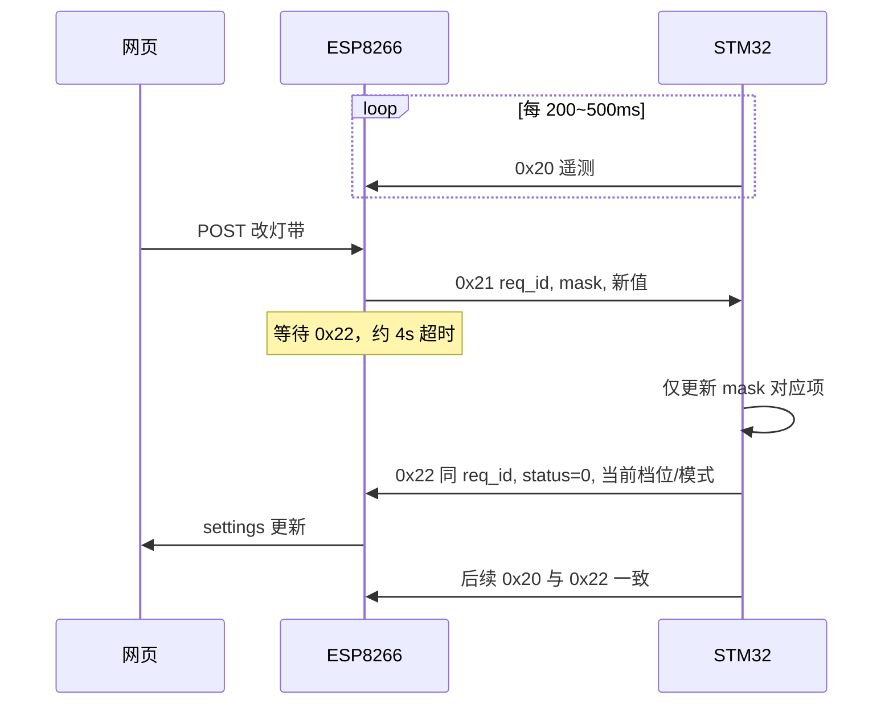

# STM32 与 ESP8266 通信指南

本文面向 **STM32 固件开发者**，说明如何通过 UART 与 TY 工程中的 ESP8266 通信。  
协议版本：**v2.1**（与 [`esp8266_stm32_link_proto.md`](esp8266_stm32_link_proto.md) 一致；该文档为双方对照的完整字段表，本文侧重 **MCU 侧如何实现**）。

---

## 1. 你在系统中的角色

```
┌──────────────┐     WiFi AP      ┌─────────────┐     HTTP      ┌────────┐
│   STM32      │ ◄── UART ──────► │  ESP8266    │ ◄───────────► │  网页   │
│  传感器/执行  │   TySerialFrame  │  网关/缓存   │  /api/status  │  用户   │
└──────────────┘                  └─────────────┘               └────────┘
```

| 方向 | 谁发起 | CMD | 含义 |
|------|--------|-----|------|
| MCU → ESP | **你周期性发送** | `0x20` | 遥测：湿度、音量、水位、档位、灯带模式、状态位 |
| ESP → MCU | ESP 收到网页 POST 后下发 | `0x21` | 写设置请求（带 `req_id`、`change_mask`） |
| MCU → ESP | **你必须尽快应答** | `0x22` | 对 `0x21` 的确认或拒绝 |

ESP8266 **不会**主动轮询 MCU；网页上的传感器数据完全来自你上报的 `0x20`。  
用户改加湿档位或灯带模式时，网页 → ESP → **`0x21`** → 你执行并回 **`0x22`**。

---

## 2. 物理层与接线

| 项目 | 约定 |
|------|------|
| 接口 | UART（异步串口） |
| 波特率 | **115200**（与 ESP 固件 `Serial.begin(115200)` 一致） |
| 数据位 / 校验 / 停止位 | 8N1（8 数据位、无校验、1 停止位） |
| 接线 | **交叉**：STM32 `TX` → ESP `RX`，STM32 `RX` ← ESP `TX`，共地 `GND` |

> ESP 侧当前使用 USB 转串口对应的 `Serial`（NodeMCU 等板型多为 UART0）。具体引脚以你的硬件原理图为准；协议只要求字节流一致。

**上电顺序建议**

1. 双方 UART 初始化完成后，STM32 即可开始发 `0x20`。
2. ESP 在 STA/AP 就绪且不再占用串口做文本配网时，会持续 `tySerialFramePoll` 解析帧；你应 **持续周期上报**，避免网页长期显示 `no_telemetry_yet`。

---

## 3. 传输层：`TySerialFrame` 帧格式

所有业务数据都包在这一层里。**收发双方必须使用相同规则**，否则 CRC 错误会被 ESP 丢弃。

### 3.1 线序（字节流）

```
┌────┬────┬─────┬──────────┬─────────────────┬──────┐
│A5  │5A  │ CMD │ LEN_LO     │ PAYLOAD[0..L-1] │ CRC8 │
│    │    │     │ LEN_HI     │                 │      │
└────┴────┴─────┴──────────┴─────────────────┴──────┘
  SOF(2)      1B      2B 小端 LEN 字节          1B
```

| 字段 | 长度 | 说明 |
|------|------|------|
| SOF | 2 | 固定 `0xA5 0x5A` |
| CMD | 1 | 业务命令，见 §4 |
| LEN | 2 | 载荷长度 **L**，**小端**（低字节在前）；**不含** CRC |
| PAYLOAD | L | 业务载荷；L 可为 0 |
| CRC8 | 1 | 见 §3.2 |

最大载荷长度：**128 字节**（本协议实际只用 4～6 字节）。

### 3.2 CRC8 算法

对下面 **连续字节** 做无符号 8 位累加和（溢出自动截断），即 `sum = (sum + byte) & 0xFF`：

```
参与校验的字节 = [ CMD, LEN_LO, LEN_HI, PAYLOAD[0], ..., PAYLOAD[L-1] ]
CRC8 = sum & 0xFF
```

**注意**：SOF 两个字节 **不参与** CRC。

### 3.3 STM32 发送一帧（C 示例）

```c
#include <string.h>
#include <stdint.h>

#define TY_SOF1  0xA5u
#define TY_SOF2  0x5Au

static uint8_t ty_crc8(const uint8_t *blk, size_t n)
{
    uint16_t sum = 0;
    for (size_t i = 0; i < n; i++) {
        sum = (uint16_t)(sum + blk[i]);
    }
    return (uint8_t)(sum & 0xFFu);
}

/* 通过已初始化的 UART 发送一帧；payload 可为 NULL 当 len==0 */
bool ty_frame_send(void (*uart_write)(uint8_t b),
                   uint8_t cmd, const uint8_t *payload, uint16_t len)
{
    if (len > 128u) return false;

    uint8_t hdr[3];
    hdr[0] = cmd;
    hdr[1] = (uint8_t)(len & 0xFFu);
    hdr[2] = (uint8_t)((len >> 8) & 0xFFu);

    uint8_t crc_blk[3 + 128];
    memcpy(crc_blk, hdr, 3);
    if (len > 0 && payload != NULL) {
        memcpy(crc_blk + 3, payload, len);
    }
    uint8_t crc = ty_crc8(crc_blk, (size_t)(3u + len));

    uart_write(TY_SOF1);
    uart_write(TY_SOF2);
    uart_write(cmd);
    uart_write(hdr[1]);
    uart_write(hdr[2]);
    for (uint16_t i = 0; i < len; i++) {
        uart_write(payload[i]);
    }
    uart_write(crc);
    return true;
}
```

### 3.4 STM32 接收状态机（要点）

1. 等待 `0xA5`，再等待 `0x5A`；若第二个不是 `0x5A`，按 ESP 实现：若当前字节又是 `0xA5` 则继续等 `0x5A`，否则回到等 SOF。
2. 读 `CMD`、`LEN_LO`、`LEN_HI`；若 `LEN > 128`，丢弃本帧，回到 SOF。
3. 读满 `LEN` 字节载荷，再读 1 字节 CRC，与本地计算比较。
4. CRC 正确则根据 `CMD` 分发；错误则丢弃，**不要**对错误帧回 `0x22`。

建议在 UART 中断或 DMA 中收字节，在主循环中解析，避免在 ISR 里做 Flash 写入等长操作。

---

## 4. 业务层命令（MCU 视角）

### 4.1 命令一览

| CMD | 方向 | 名称 | 载荷长度 | MCU 动作 |
|-----|------|------|----------|----------|
| `0x20` | MCU → ESP | SensorReport | **固定 6** | 周期发送，上报全量状态 |
| `0x21` | ESP → MCU | SetRequest | **固定 4** | 解析并按 `change_mask` 改参数，回 `0x22` |
| `0x22` | MCU → ESP | SetAck | **固定 5** | 仅作为对 `0x21` 的应答 |

### 4.2 枚举常量（建议头文件）

```c
#define TY_CMD_SENSOR_REPORT  0x20u
#define TY_CMD_SET_REQUEST    0x21u
#define TY_CMD_SET_ACK        0x22u

#define TY_CHG_HUMID          0x01u   /* change_mask bit0：加湿档位 */
#define TY_CHG_LED            0x02u   /* change_mask bit1：灯带模式 */

/* humidifier_level / led_strip_mode 均为 0~3 */
#define TY_HUMID_OFF          0u
#define TY_HUMID_LEVEL1       1u
#define TY_HUMID_LEVEL2       2u
#define TY_HUMID_LEVEL3       3u

#define TY_LED_SOLID          0u
#define TY_LED_BREATH         1u
#define TY_LED_FLOW           2u
#define TY_LED_MUSIC          3u   /* 音律，随音量 */

/* status_flags (0x20 字节5) */
#define TY_FLAG_OVERHEAT      0x01u
```

---

## 5. 你必须做的事：周期遥测 `0x20`

**固定 6 字节载荷**，建议周期 **200～500 ms**（不超过 1 s），与 ESP 网页约 800 ms 轮询匹配。

| 偏移 | 字段 | 范围 / 含义 |
|------|------|-------------|
| 0 | `humidity_pct` | 0–100，相对湿度 % |
| 1 | `audio_level` | 0–255，麦克风/音量强度 |
| 2 | `water_level_pct` | 0–100，水位 % |
| 3 | `humidifier_level` | 0–3，当前加湿档位（§4.2） |
| 4 | `led_strip_mode` | 0–3，当前灯带模式 |
| 5 | `status_flags` | 位 0：`1`=过热；位 1–7 必须为 0 |

**规则**

- `len != 6` 时 ESP **整帧丢弃**，不更新缓存。
- 字节 3、4 超出 0–3 时，建议 MCU 侧钳位后再发，避免 ESP 丢弃。
- 本地按键、旋钮修改档位/灯带后，**下一帧 `0x20` 必须反映新状态**，否则网页与 `0x22` 不一致。

**示例**（湿度 55%、音量 200、水位 88%、加湿 2 档、呼吸灯、无过热）：

载荷十六进制：`37 C8 58 02 01 00`  
完整线序：`A5 5A 20 06 00 37 C8 58 02 01 00 80`

---

## 6. 你必须响应的事：写设置 `0x21` → `0x22`

### 6.1 `0x21` 载荷（ESP → MCU）

| 偏移 | 字段 | 说明 |
|------|------|------|
| 0 | `req_id` | 事务 ID，**1–255**；**禁止 0** |
| 1 | `change_mask` | 至少一位为 1；见下表 |
| 2 | `humidifier_level` | 仅当 `mask & 0x01` 时有效 |
| 3 | `led_strip_mode` | 仅当 `mask & 0x02` 时有效 |

**`change_mask` 语义（核心）**

| `change_mask` | 含义 | 你对字节 2、3 的处理 |
|---------------|------|------------------------|
| `0x01` | 只改加湿 | **只**更新加湿档位；**不要**改灯带 |
| `0x02` | 只改灯带 | **只**更新灯带；**不要**改加湿 |
| `0x03` | 合包 | 两项都更新 |
| `0x00` 或含保留位 | 非法 | 拒绝，`status != 0`，**不改**任何参数 |

未在 mask 中置位的字段，对应字节可忽略（建议填 0）。

### 6.2 `0x22` 载荷（MCU → ESP）

收到合法 `0x21` 后，**尽快**回复（建议 **< 100 ms**，Flash 写入等除外）：

| 偏移 | 字段 | 说明 |
|------|------|------|
| 0 | `req_id` | **必须与 `0x21` 相同** |
| 1 | `status` | `0`=成功；非 0 见 §6.3 |
| 2 | `change_mask` | **回显** `0x21` 中的 mask |
| 3 | `humidifier_level` | 当前**已生效**的加湿档位（0–3） |
| 4 | `led_strip_mode` | 当前**已生效**的灯带模式（0–3） |

即使本次只改了灯带，字节 3、4 也要带 **完整当前设定**（例如加湿仍为 2 档）。

ESP 仅在「正在等待该 `req_id`」时处理此帧；其它 `req_id` 的 `0x22` 会被忽略。  
等待超时约 **4 s**；超时后网页显示 `timeout`，设定冻结直到下次成功同步。

### 6.3 建议 `status` 错误码

| status | 含义 |
|--------|------|
| 0 | 成功 |
| 1 | `change_mask == 0` |
| 2 | `humidifier_level` 非法（非 0–3）且 mask 含 `0x01` |
| 3 | `led_strip_mode` 非法（非 0–3）且 mask 含 `0x02` |
| 4 | `change_mask` 含保留位（bit2–bit7 非 0） |
| 其他 | 项目自定义 |

拒绝时：**不要**修改 RAM/Flash 中的用户设定。

### 6.4 处理流程（伪代码）

```c
void on_ty_frame(uint8_t cmd, const uint8_t *pl, uint16_t len)
{
    if (cmd == TY_CMD_SET_REQUEST && len == 4) {
        uint8_t rid  = pl[0];
        uint8_t mask = pl[1];
        uint8_t hum  = pl[2];
        uint8_t led  = pl[3];
        uint8_t st   = 0;

        if (rid == 0) st = 1;
        else if (mask == 0) st = 1;
        else if (mask & ~0x03u) st = 4;
        else {
            if ((mask & TY_CHG_HUMID) && hum > 3) st = 2;
            if (st == 0 && (mask & TY_CHG_LED) && led > 3) st = 3;
        }

        if (st == 0) {
            if (mask & TY_CHG_HUMID) apply_humid_level(hum);
            if (mask & TY_CHG_LED)     apply_led_mode(led);
            /* 可选：save_to_flash(); */
        }

        uint8_t ack[5] = {
            rid,
            st,
            mask,
            get_current_humid_level(),
            get_current_led_mode()
        };
        ty_frame_send(uart_write_byte, TY_CMD_SET_ACK, ack, 5);
    }
}
```

### 6.5 示例：只改灯带为流水（`req_id = 5`）

**ESP 发来 `0x21`**  
载荷：`05 02 00 02` → 线序 `A5 5A 21 04 00 05 02 00 02 2E`

**你回复 `0x22` 成功**（假设加湿仍为 2 档）  
载荷：`05 00 02 02 02` → 线序 `A5 5A 22 05 00 05 00 02 02 02 32`

---

## 7. 时序关系（理解即可，无需实现 HTTP）



---

## 8. 实现检查清单

在提交 MCU 固件前，请逐项确认：

- [ ] UART **115200 8N1**，TX/RX 交叉、共地。
- [ ] 帧 SOF、`LEN` 小端、CRC8 与 §3 完全一致（可用附录帧做环回自测）。
- [ ] **`0x20` 固定 6 字节**，周期 ≤ 1 s，字段与真实硬件一致。
- [ ] 收到 **`0x21` 必回 `0x22`**，`req_id` 一致；`change_mask` 回显。
- [ ] **单控**时未置位 mask 的字段 **绝不修改**。
- [ ] `0x22` 字节 3、4 为 **当前完整生效值**，不仅是“本次写入值”。
- [ ] `change_mask == 0` 或非法值：`status != 0`，且不写 Flash。
- [ ] `req_id` 不使用 0；本地改参数后下一帧 `0x20` 更新。
- [ ] 过热等异常及时置位 `status_flags` 位 0。

---

## 9. 调试建议

1. **先只发 `0x20`**：ESP 串口日志可见 `[TY] frame cmd=32`；网页 `/api/status` 中 `sensor.valid` 应为 `true`。
2. **用逻辑分析仪或 USB 串口助手**核对完整十六进制是否与 §5、§6.5 一致。
3. **模拟 `0x21`**：从 PC 经 UART 注入 `A5 5A 21 04 00 ...`，确认 MCU 回 `0x22` 且 `req_id` 匹配。
4. ESP 侧 `frames_crc_err` 增加 → 优先查波特率、CRC 计算是否包含 CMD+LEN+payload、是否误把 SOF 算进 CRC。

---

## 10. 版本与参考

| 项目 | 说明 |
|------|------|
| 协议版本 | v2.1（`change_mask` + `req_id` 单控/合包） |
| 与 v1 关系 | 不兼容旧版「目标湿度 / humidifier_on / gear」等字段 |
| ESP 实现 | `include/TySerialFrame/`、`include/TyDeviceComm/`、`src/main.cpp` |
| 双方字段对照 | [`esp8266_stm32_link_proto.md`](esp8266_stm32_link_proto.md) |

扩展新可写字段时，需在 `change_mask` 增加新位并扩展 `0x21`/`0x22` 载荷长度（或新增 CMD）；升级前与 ESP 固件负责人对齐。

---

## 附录 A：完整帧速查

| 场景 | 线序（十六进制，空格分隔） |
|------|---------------------------|
| 0x20 遥测示例 | `A5 5A 20 06 00 37 C8 58 02 01 00 80` |
| 0x21 只改灯带 | `A5 5A 21 04 00 05 02 00 02 2E` |
| 0x22 上条成功 ACK | `A5 5A 22 05 00 05 00 02 02 02 32` |
| 0x21 合包 humid+led | `A5 5A 21 04 00 06 03 03 01 32` |
| 0x22 合包成功 ACK | `A5 5A 22 05 00 06 00 03 03 01 34` |

CRC 可用 §3.2 在 MCU 上验算；与 ESP `TySerialFrame.cpp` 行为一致。
